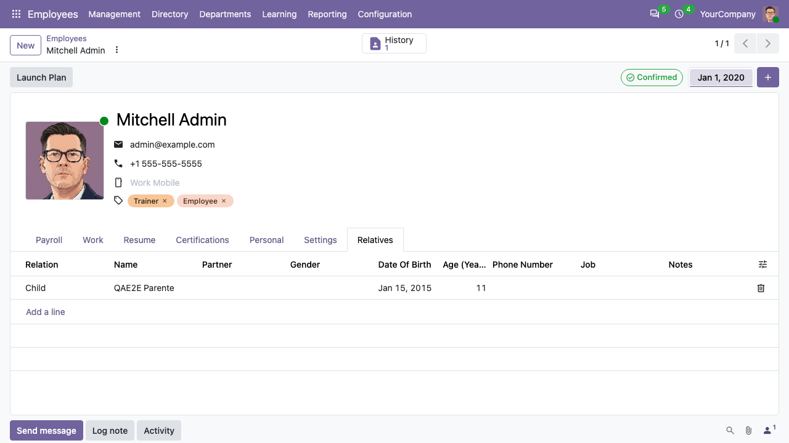

To register the relatives of an employee:

1. Go to *Employees > Employees* and open the employee.
2. Open the *Relatives* tab and click *Add a line*.
3. Fill in the *Relation* (Spouse, Child, Parent...), the *Name* (or pick a
   *Partner*, which fills the name), and optionally the gender, date of birth,
   phone number, job and notes.
4. Save the employee.

The age of the relative (years, months and days) is computed from the date of
birth. The *Relatives* tab is visible to HR officers; creating and editing
relatives requires the *Employees / Administrator* access.

The relation types are defined in *hr.employee.relative.relation* and can be
extended with new records.
